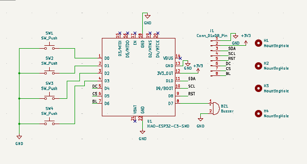
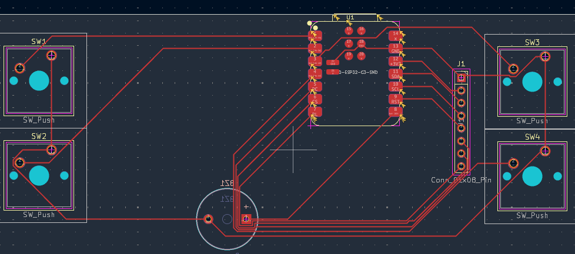
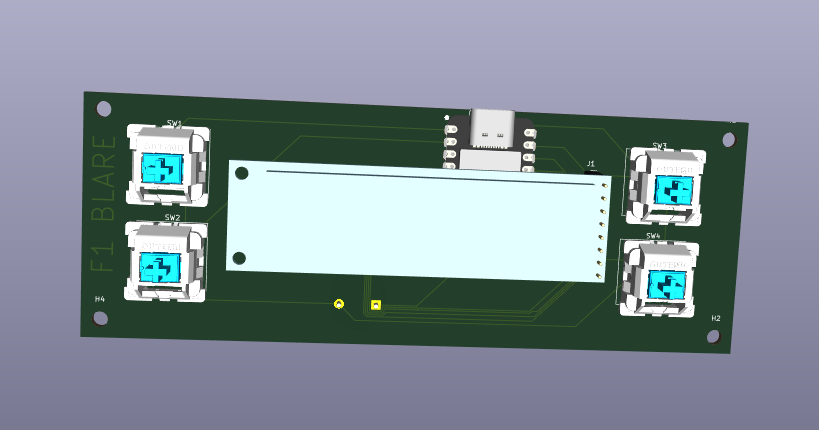
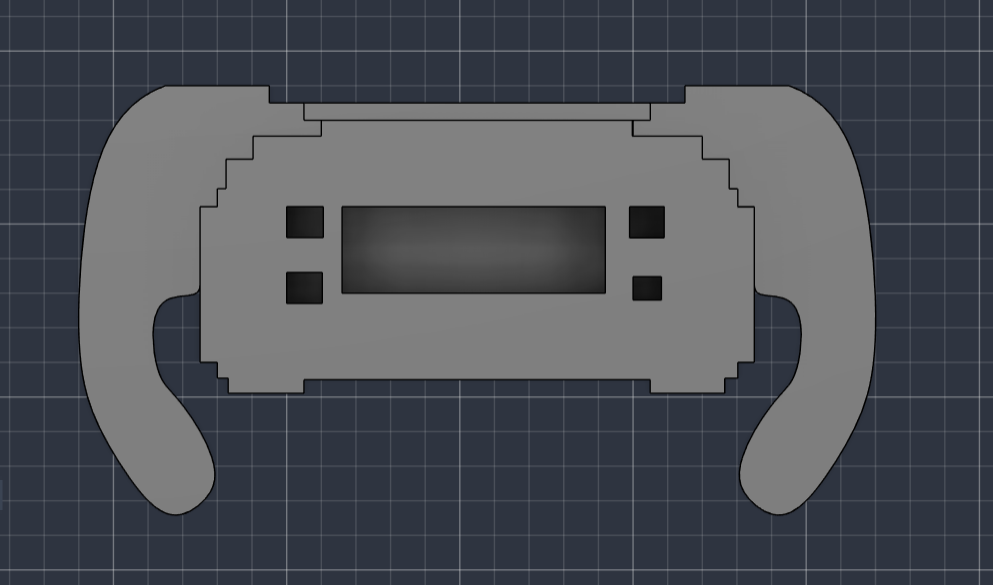
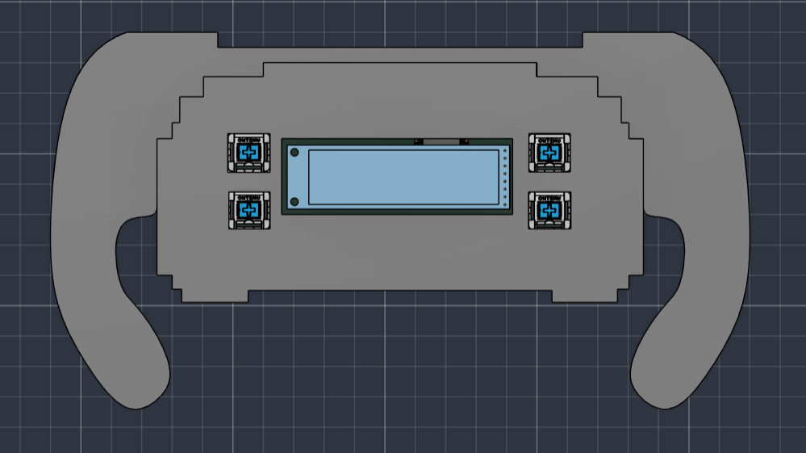

# F1 BLARE 🏎️⏰

## Inspiration

I wanted to make a BLARE alarm clock, but I didn't want it to look like a normal alarm clock.

Since I really like Formula 1, I decided to design the enclosure around the shape and layout of an F1 steering wheel. The goal was to make something that looks like a small racing control system while still functioning as a practical alarm clock.

The display is placed in the center like the display on an F1 steering wheel, with four buttons around it for controlling the clock and alarms.

The four buttons are used for:

- `+`
- `Set Alarm / Stop Alarm`
- `-`
- `Change Screen`

There are four screens: the normal clock and three different alarm screens.

### Challenges

This was my first time making a PCB and working with KiCad, so there were quite a few things I had to figure out.

I had to learn how to make the schematic, assign footprints, route the PCB, check it with DRC and add 3D models.

One of the biggest challenges was designing the PCB so that all the components, buttons and display connections would fit into a compact enclosure.

I originally planned to use an F1 car model as part of the enclosure, but I changed the design so that the enclosure itself is F1-inspired and can be designed directly as a proper CAD model. This makes the final design easier to manufacture and 3D print.

### Specifications

BOM:

- 1x Seeed XIAO ESP32-C3
- 4x Cherry MX-style switches
- 1x 2.25" TFT display
- 1x 3.3V piezo buzzer
- 1x 8-pin connector for the display
- 8x female-female jumper wires
- 4x M3x8 screws
- 4x M3x16 screws
- 8x M3 heatset inserts

Others:

- Arduino firmware
- Custom PCB
- Custom F1 steering-wheel-inspired enclosure
- 3D printed enclosure

### How it works

The main screen shows the current time.

Pressing the fourth button changes between the clock and the three alarm screens.

On an alarm screen:

- `+` increases the alarm time
- `-` decreases the alarm time
- `Set Alarm` enables/disables the alarm

When an alarm goes off, the buzzer plays until the user presses the alarm button.

The enclosure is designed around an F1 steering wheel layout, with the TFT display positioned in the center and the four physical controls placed around it.

### Schematic

### PCB

| PCB | 3D Model |
| --- | --- |
|  |  |

### Case

The PCB will be mounted inside a custom 3D-printed enclosure inspired by an F1 steering wheel.

The 2.25" TFT display is positioned in the center of the front panel, with the four buttons arranged around it for easy access.

The enclosure will use rounded edges, racing-inspired shapes and details while keeping the internal geometry practical for 3D printing.

Unlike using an imported F1 car STL, the enclosure itself is designed as a proper CAD model so that the dimensions can be matched to the PCB and components.

### Firmware

The firmware is written using Arduino IDE and runs on the XIAO ESP32-C3.

The TFT display is controlled using the Adafruit GFX and ST7789 libraries.

The firmware handles:

- Digital clock display
- Three independent alarms
- Alarm time adjustment
- Alarm enable/disable
- Buzzer control
- Screen switching